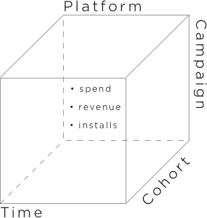

# Almacén

## Introduction

### What is it?
Almacén is a Pythonic/SQL data warehouse that automates the fetching and structuring of mobile app marketing data from a spectrum of sources, including but not limited to Google AdWords/UAC, Apple Search Ads, Facebook Ads, AppsFlyer and Adjust KPI.

### Why is it useful?
Almacén saves time that would otherwise be required to collect, combine, and organize marketing data. Reporting is tedious and error-prone when done manually; Almacén improves accuracy and morale.

## How It Works

### Client Configuration
Almacén uses a file called `clients_config.py`, that defines the data sources and transformations associated with each of Incipia's clients. Here's a snippet that demonstrates PeopleFun's configuration:

```python
'peoplefun': {
    'company_metadata': {
      'display_name': 'PeopleFun',
    },
    'fetch': {
      'google_adwords': {
        'wordscapes': {
          'display_name': 'Wordscapes',
          'credentials_key': 'incipia',
          'report_types': ['fetch_google_adwords_campaigns'],
          'client_customer_id': 8710091922,
        },
      },
      'appsflyer': {
        'wordscapes_android': {
          'app_id': 'com.peoplefun.wordcross',
          'credentials_key': 'peoplefun',
          'report_types': ['fetch_appsflyer_purchase_events', 'fetch_appsflyer_install_events'],
        },
        'wordscapes_ios': {
          'app_id': 'id1207472156',
          'credentials_key': 'peoplefun',
          'report_types': ['fetch_appsflyer_purchase_events', 'fetch_appsflyer_install_events'],
        },
      },
      ...
    },
    ...
}
```

### Fetching
Here's an example of the command that Almacén interprets for fetching AppsFlyer data on behalf of PeopleFun:

`python main.py peoplefun fetch appsflyer`

The stages that take place during the execution of this command are as follows:

1. Target date range calculation based on previously collected data
2. API client is provided for the source channel
3. Raw report data is fetched and converted into a Pandas data frame
4. The data frame is processed — sanitized, filtered, and augmented with auxiliary data
5. The data frame is written to Almacén's SQL database

### Mutating
Following fetching new data, Almacén consolidates various tables to reduce overhead of generating cohort-based reports and limit the need to store raw data indefinitely. Here's an example of the command that will trigger the mutation process:

`python main.py peoplefun mutate appsflyer`

The table built from running the command above uses the following structure:

| Comapany Name | App Name | App ID | Channel | Campaign ID | Platform | Touch Date | Day | Installs | Revenue
|:----------:| :-------------:| :-------------:| :-------------:| :-------------:| :-------------:| :-------------:| :-------------:| :-------------:| :-------------:|
| PeopleFun | Wordscapes | com.peoplefun.wordcross | Facebook Ads | 6088578584711 | android | 2018-05-03 | 3 | 1 | 10.458

As you can see, the table above contains columns for aggregated installs and revenue data, and allows us to easily create an SQL view on top of it for organizing these metrics by cohort day or week.

## Data Structure

Almacén produces a data cube to provide a flexible data source for cohort and campaign-centered data analysis. The current dimensions of the data cube are **campaign, platform, cohort date** and **time**, and the current measures are *spend, revenue,* and *installs.*

<br>

<br>